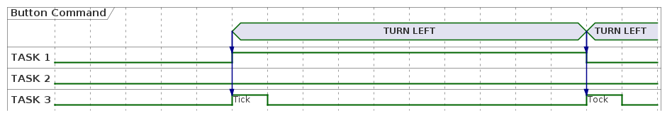

# Introduction

Hello and welcome to the CTS 2023 embedded trail. In this trail you will be introduced to basic real-time system concepts and how to utilize them in FreeRTOS, a real-time system core for embedded devices. With these concepts, you will finalize a mini version of a car's telltale: brake, hazard and turn indicators will all be implemented using light and sound that can be controlled from a circuit board.

TODO add ToC

## Raspberry Pi Pico

To realize the project, we will use a Raspberry Pi Pico. The Pico is based on the RP2040 microcontroller, which has a dual-core Arm Cortex-M0 CPU at 133Mhz (though clocked at 125Mhz by default). It has 264kB RAM and 2MB flash memory. The rest of the specifications can be read [here](https://www.raspberrypi.com/documentation/microcontrollers/rp2040.html). Pico has a logic voltage of 3.3V, which means that a GPIO pin that is high will have a voltage of 3.3V.

The board has 28 GPIO pins. GPIO pins are software-controlled connectors that can be used as input or output. Some pins can be used either as GPIO or for other functions such as I2C or PWM to configure it.

NOTE: When we refer to GPIO pins, we mean what is written in the green boxes in the reference image of the Picon, which corresponds to another physical pin (the gray boxes).

Some interesting pins:

- VBUS is connected directly to the micro-USB port and measures 5V when you have a USB adapter connected.
- VSYS is connected to VBUS via a diode. It is possible to drive the Pico directly by soldering a 1.8V to 5.5V voltage source to VSYS if you don't like USB. A Switching Mode Power Supply then converts the input voltage to 3.3V which powers the Pico.
- The 3V3_EN(able) pin can connect to ground to turn off the voltage converter, and then the Pico stops.
- The 3V3 pin is connected to the 3.3V operating voltage and can be used to drive components, the datasheet recommends not to draw more than 300mA.
The RUN pin can be used to restart the Pico, if connected to ground.

Others are described in the data sheet if you are interested.

The PICO has a BOOTSEL button. If you hold it down when you start the Pico, it is put into programmer mode, and appears as a portable USB disk.

## The Circuit Board (PCB)

On the circuit board, you can find a Raspberry Pi Pico that is routed in the PCB to be able to read input from 4 buttons and control 16 orange LEDs & 1 buzzer. Input/output is handled in the GPIO configuration that is *purposely* abstracted from the participants of this trail.

There is also a fifth button closest to the Pico board. This button ties RUN pin to ground when pressed which restarts the Pico.

### GPIO configuration table

Skip this section if you are not interested in which GPIO is connected to what.

| GPIO | GPIO CONFIG | HW desc |
| ---- |---- |------- |
| 2    | OUT | LED_FL0 |
| 3    | OUT | LED_FL1 |
| 4    | OUT | LED_FL2 |
| 5    | OUT | LED_FL3 |
| 6    | OUT | LED_FR0 |
| 7    | OUT | LED_FR1 |
| 8    | OUT | LED_FR2 |
| 9    | OUT | LED_FR3 |
| 10   | OUT | LED_RL0 |
| 11   | OUT | LED_RL1 |
| 12   | OUT | LED_RL2 |
| 13   | OUT | LED_RL3 |
| 19   | OUT | LED_RR0 |
| 18   | OUT | LED_RR1 |
| 17   | OUT | LED_RR2 |
| 16   | OUT | LED_RR3 |
| 14   | IN / PULL-UP | L_INDCR_BTN |
| 15   | IN / PULL-UP| L_INDCR_BTN |
| 20   | IN / PULL-UP| BRAKE_BTN |
| 21   | IN / PULL-UP| HAZARD_BTN |
| 22   | OUT / PWM | BUZZER |

Raspberry Pi Pico is not driving all LEDs directly, instead a MOSFET transistor is used for each LED to drive each individual LED using the +5V from the USB bus. This setup makes it possible for the 3.3V GPIO to control an LED with +5V forward voltage.

Simplification of the parameters:
- R_LED regulates the current that drives the LED i.e. the brightness
- R_PULLDOWN makes sure that the gate is closed by default. It "pulls" down the gate voltage to ground.
- R_GATE regulates the speed at which the MOSFET gate opens. (Other parameters affect this as well e.g. input impedance, internal GPIO resistors etc.)

## Workshop goals

| Button | Action | Expected outcome |
| ------ | ------ | --------- |
| Turn left | On press | Front left & rear left headlights toggles at a fixed interval. Buzzer plays a tick sound for each flash. |
| Turn right | On press | Front right & rear right headlights toggles at a fixed interval. Buzzer plays a tick sound for each flash. |
| Hazard | On press | All headlights headlights toggles at a fixed interval. Buzzer plays a tick sound for each flash. |
| Brake | On hold | All headlights are on. |

Fixed interval is XXXXX Hz!!! TODOO
Here is a gif of how the results will look like:
!!!TODO ADD A GIF WITH REFERENCE SOLUTION!!!

# Workshop

## Preparation

Set up environment, build and flash test code provided by team task force

## Interrupt Handling

Introduce pico SDK calls to configure interrupt handling and callbacks on button presses.

Introduce our API for how to turn on leds

Introduce FreeRTOS calls that should be used within ISR (?)

## Step 1: Handle button commands

Implement logic to handle the buttons TURN RIGHT, TURN LEFT, HAZZARD, BREAK

### Task scheduling

Introduce FreeRTOS API to how to create tasks and communicate between tasks e.g. queues, mailboxes whatever

## Step 2: TURN LEFT and TURN RIGHT

**Expected results:**

* When TURN LEFT button is pressed the LHS LEDs should turn ON and RHS LEDs turn OFF. If the button is pressed again, the LHS LEDs should turn OFF
* When TURN RIGHT button is pressed the RHS LEDs should turn on and LHS LEDs turn OFF. If the button is pressed again, the RHS LEDs should turn OFF

### Syncing tasks
Introduce FreeRTOS API on how to sync between tasks

## Step 3: Hazzard

**Expected results:**

* When HAZZARD button is pressed both LHS and RHS should turn ON at the same time. When button is pressed again, both sides should turn OFF at the same time.

## Step 4: Buzzer (TICK/TOCK sound)

During a Turn indication there is a sound being played in the car to notify the driver. Some brands wants only a "Tick" when the LEDs goes from OFF -> ON and some wants both "Tick" and "Tock". Tick when LEDs goes from OFF -> ON and Tick when led goes from ON -> OFF.

**Expected results:**
* During HAZZARD/TURN LEFT/TURN RIGHT commands there should be a Tick/Tock sound being played when the corresponding LEDs turns ON/OFF

## Step 5: Periodicity

Until this point the LEDs are able to turn ON/OFF with button commands. However in the car this feature is no.....

### Handle shared resources
Introduce FreeRTOS API to handle shared resources: semaphores etc.

**Expected results:**

## Step 6: Break button

**Expected results:**

## Step 7: One Task that controlls each LED row

T1 FRONT LEFT
T2 REAR LEFT
T3 FRONT RIGHT
T4 REAR RIGHT

**Expected results:**