# Introduction

Hello and welcome to the CTS 2023 embedded trail. In this trail you will be introduced to basic real-time system concepts and how to utilize them in FreeRTOS, a real-time system core for embedded devices. With these concepts, you will finalize a mini version of a car's telltale: brake, hazard and turn indicators will all be implemented using light and sound that can be controlled from a circuit board.

- [Introduction](#introduction)
  - [Raspberry Pi Pico](#raspberry-pi-pico)
  - [The Circuit Board (PCB)](#the-circuit-board-pcb)
    - [GPIO configuration table](#gpio-configuration-table)
  - [Workshop goals](#workshop-goals)
- [Workshop preparation](#workshop-preparation)
  - [Preparation](#preparation)
  - [Prepare the development environment](#prepare-the-development-environment)
  - [How to build an image](#how-to-build-an-image)
  - [How to flash an image to Pico](#how-to-flash-an-image-to-pico)
    - [Step 1: Enter programming mode](#step-1-enter-programming-mode)
    - [Step 2: Flash image](#step-2-flash-image)
      - [Flashing using picotool](#flashing-using-picotool)
      - [Flashing by moving UF2 to mass-storage device](#flashing-by-moving-uf2-to-mass-storage-device)
  - [Building for the Simulator](#building-for-the-simulator)
  - [Running the Simulator](#running-the-simulator)
  - [Autocompletion in VS Code](#autocompletion-in-vs-code)
- [Workshop starts here](#workshop-starts-here)
  - [Step 1: Handle button commands](#step-1-handle-button-commands)
    - [Expected result](#expected-result)
  - [Step 2: TURN LEFT and TURN RIGHT](#step-2-turn-left-and-turn-right)
    - [Expected results:](#expected-results)
  - [Step 3: Hazard](#step-3-hazard)
    - [Expected results:](#expected-results-1)
  - [Step 4: Buzzer (TICK/TOCK sound)](#step-4-buzzer-ticktock-sound)
    - [Expected results:](#expected-results-2)
  - [Step 5: Periodicity](#step-5-periodicity)
    - [Expected results:](#expected-results-3)
  - [Step 6: Brake button](#step-6-brake-button)
    - [Expected results:](#expected-results-4)
  - [Step 7 (BONUS): One Task that controls each LED row](#step-7-bonus-one-task-that-controls-each-led-row)
    - [Expected results:](#expected-results-5)
- [API Documentation](#api-documentation)
  - [Pico SDK API](#pico-sdk-api)
    - [Interrupt Handling](#interrupt-handling)
    - [Polling](#polling)
  - [Cygnicator API](#cygnicator-api)
  - [FreeRTOS Task API](#freertos-task-api)
    - [xTaskCreate()](#xtaskcreate)
    - [vTaskStartScheduler()](#vtaskstartscheduler)
    - [vTaskDelay()](#vtaskdelay)
  - [Inter-task communication](#inter-task-communication)
    - [Queue example](#queue-example)
    - [Binary Semaphores](#binary-semaphores)
    - [Mutexes](#mutexes)
    - [Direct Task notification](#direct-task-notification)
    - [Stream/Message buffers](#streammessage-buffers)
      - [Stream buffers](#stream-buffers)
      - [Message buffers](#message-buffers)
  - [Syncing tasks](#syncing-tasks)
    - [Event Groups](#event-groups)

## Raspberry Pi Pico

To realize the project, we will use a Raspberry Pi Pico. The Pico is based on the RP2040 micro controller, which has a dual-core Arm Cortex-M0 CPU at 133Mhz (though clocked at 125Mhz by default). It has 264kB RAM and 2MB flash memory. The rest of the specifications can be read [here](https://www.raspberrypi.com/documentation/microcontrollers/rp2040.html). Pico has a logic voltage of 3.3V, which means that a pin that is high - i.e. has it's output enabled - will have a voltage of 3.3V.

The board has 28 GPIO pins. GPIO stands for general purpose input/output. GPIO pins are software-controlled connectors that can be used as input or output. Some pins can be used either as GPIO or for other functions such as I2C or PWM if you configure them for it.

NOTE: When we refer to GPIO pins by id, we mean the the id's written in the green boxes in the reference image of the Pico. Each GPIO id corresponds to another id (physical pin number, the gray boxes), which has a different numbering scheme.


All pins are described in the data sheet if you are interested in knowing what function they have.

The PICO has a BOOTSEL button. If you hold it down when you start the Pico, it is put into programmer mode, and appears as a portable USB disk. We will describe how to flash the PICO using this pin later in this readme.

## The Circuit Board (PCB)

On the circuit board, you can find a Raspberry Pi Pico that is routed in the PCB to be able to read input from 4 buttons and control 16 orange LEDs & 1 buzzer. Input/output is handled in the GPIO configuration that is *purposely* abstracted from the participants of this trail.


There is also a fifth button closest to the Pico board. This button ties RUN pin to ground when pressed which restarts the Pico.

### GPIO configuration table

Skip this section if you are not interested in which GPIO is connected to what.

| GPIO | GPIO CONFIG  | HW desc     |
| ---- | ------------ | ----------- |
| 2    | OUT          | LED_FL0     |
| 3    | OUT          | LED_FL1     |
| 4    | OUT          | LED_FL2     |
| 5    | OUT          | LED_FL3     |
| 6    | OUT          | LED_FR0     |
| 7    | OUT          | LED_FR1     |
| 8    | OUT          | LED_FR2     |
| 9    | OUT          | LED_FR3     |
| 10   | OUT          | LED_RL0     |
| 11   | OUT          | LED_RL1     |
| 12   | OUT          | LED_RL2     |
| 13   | OUT          | LED_RL3     |
| 19   | OUT          | LED_RR0     |
| 18   | OUT          | LED_RR1     |
| 17   | OUT          | LED_RR2     |
| 16   | OUT          | LED_RR3     |
| 14   | IN / PULL-UP | L_INDCR_BTN |
| 15   | IN / PULL-UP | L_INDCR_BTN |
| 20   | IN / PULL-UP | BRAKE_BTN   |
| 21   | IN / PULL-UP | HAZARD_BTN  |
| 22   | OUT / PWM    | BUZZER      |

Raspberry Pi Pico is not driving all LEDs directly, instead a MOSFET transistor is used for each LED to drive each individual LED using the +5V from the USB bus. A MOSFET is a type of transistor that controls the flow of electrical current by varying the voltage applied to a gate terminal. This setup makes it possible for the 3.3V GPIO to control an LED with +5V forward voltage. 

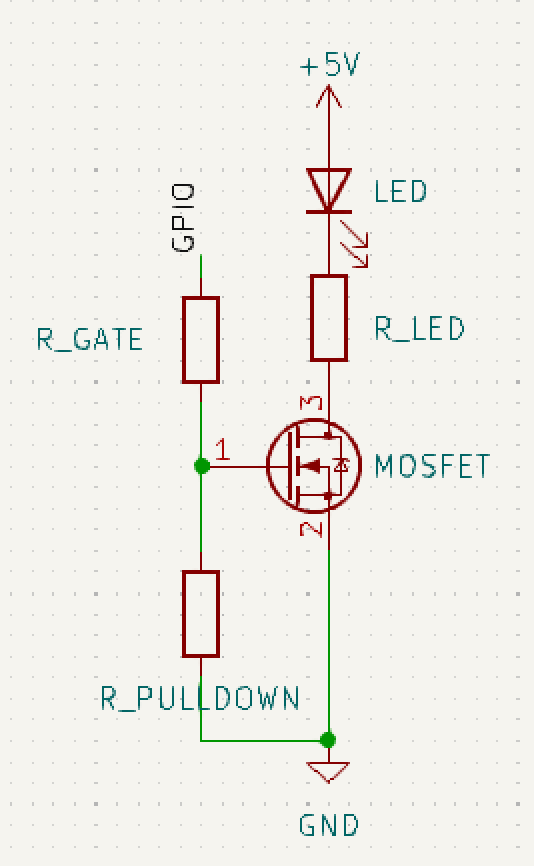

As you see in the picture, there are three resistors for each MOSFET. Simplification of the parameters:
- R_LED regulates the current that drives the LED i.e. the brightness
- R_PULLDOWN makes sure that the gate is closed by default. It "pulls" down the gate voltage to ground.
- R_GATE regulates the speed at which the MOSFET gate opens. (Other parameters affect this as well e.g. input impedance, internal GPIO resistors etc.)

## Workshop goals

The goal of the workshop is to implement the telltale for the car on the PCB, with the buttons controlling the behavior as listed in the table below.
Notice that the lights are LED segments with 4 individual LEDs for each light. That is so that we can implement sweeping indicator lights, like on the new [Volvo EX90](https://www.youtube.com/shorts/eO_5jhUtqR8).

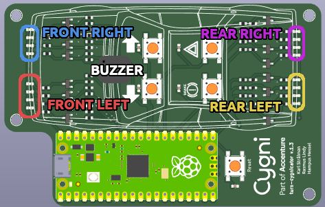

| Button     | Action   | Expected outcome                                                                                           |
| ---------- | -------- | ---------------------------------------------------------------------------------------------------------- |
| Turn left  | On press | Front left & rear left headlights toggles at a fixed interval. Buzzer plays a tick sound for each flash.   |
| Turn right | On press | Front right & rear right headlights toggles at a fixed interval. Buzzer plays a tick sound for each flash. |
| Hazard     | On press | All headlights headlights toggles at a fixed interval. Buzzer plays a tick sound for each flash.           |
| Brake      | On hold  | Only REAR RIGHT and REAR LEFT headlights are on.                                                           |


By fixed interval in the table above we mean it should be toggled at 2Hz. For the turn indicator, this would be according to the time diagram below. Note that we don't include Tock sound. Cooler car brands do this. We don't know why:

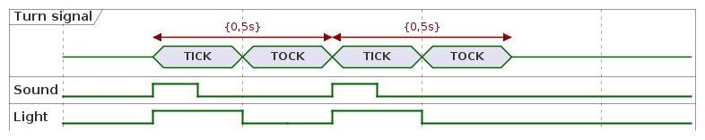

Here is a gif of how the results will look like:

[final.webm](https://github.com/cygni/cts2023-turn-cygnicator/assets/25175673/18735ce9-be89-4dc5-a5c7-94b2c8693f9b)

In a normal car, when the hazard is on and the brake is issued, the hazard continues after the brake has been released. In this workshop we do not require this behavior instead it's up to the designer how to handle this. You will see in the time diagrams later in the workshop that we suggest that you need to reissue the hazard after braking. The same goes for turn indicator.

# Workshop preparation

There are some preparations that we recommend you do before the workshop begins.

## Preparation

At the end of this section, you should be able to know where to add changes, and how to build and flash. To test the circuit board, we have provided a blinky code example that is going to be flashed onto the board.

Important folders and files:
```bash
# Your workspace, feel free to add more workspaces if needed.
firmware/turn-cygnicator

# ..we suggest you work in the same workspace throughout the workshop
# since every step builds on the previous one.

# Main entrypoint to your solution
firmware/turn-cygnicator/main.c

# Binary image that will be flashed onto the Raspberry Pi Pico
firmware/turn-cygnicator/turn-cygnicator.uf2

# Cygni turnindicator (Cygnicator) APIs
firmware/inc

# FreeRTOS kernel, you shouldn't need to touch this
firmware/lib/FreeRTOS-Kernel

# FreeRTOS configuration file for this project, you shouldn't need to touch this
firmware/inc/FreeRTOSConfig.h

```

## Prepare the development environment

The first step is to build the docker image (`firmware/docker/Dockerfile`) that contains the FreeRTOS kernel, pico SDK, picotool and other tools/libraries that are needed.

Run this command in the root folder of this repository:
`docker build --build-arg UID="$(id -u)" -t rpisdk:latest docker/` or run
`build_docker.sh`

It takes a couple of minutes to download all dependencies, this command should only be run once.

## How to build an image

```bash
cd firmware

./build.sh

# Expected output
=== Output Files ===
./firmware/build/turn-cygnicator/turn-cygnicator.uf2
./firmware/build/blinky-demo/blinky-demo.uf2
```

## How to flash an image to Pico

### Step 1: Enter programming mode

Before flashing the image, the Pico needs to enter its programming mode.

1. Hold the BOOTSEL button (marked with a red box)
2. Press the RESET button (marked with a blue box)
3. Release BOOTSEL button

Here is a complementary GIF on how to do this:

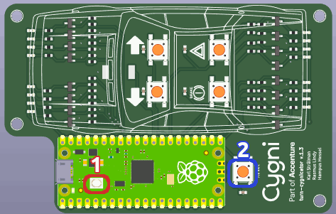

Now the Pico has entered programming mode, it should appear to your host computer as a mass-storage device, like a USB memory stick. If it doesn't, you need to redo step 1.

### Step 2: Flash image

There are two alternatives on how to flash in this guide.

Either use:
- **picotool** provided in the docker image 
- **move UF2 image manually** to the mass-storage device.

#### Flashing using picotool

For convenience, we have included a flash script that shortens the command that is needed to flash.
Flash blinky sample code to verify that communication towards Pico works:
```bash
cd firmware

./flash.sh blinky-demo/blinky-demo.uf2
```

The expected results should look like this:

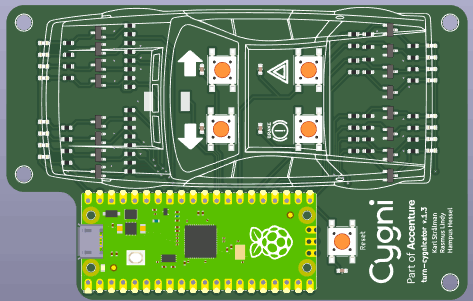

..by default this command flashes `turn-cygnicator` workspace, which is where your implementation is located. **Refer to this flash instruction during the workshop:**
```bash
cd firmware

./flash.sh
```

**Troubleshooting flash step:**
```bash
# Command that you run
$ docker run \
  --rm \
  -v $(pwd):$(pwd) \
  -w $(pwd)/build \
  --name rpibuilder \
  --privileged rpisdk:latest \
  /bin/picotool load -v -x blinky-demo/blinky-demo.uf2

# ------------------
# Expected output:
Loading into Flash: [==============================]  100%
Verifying Flash:    [==============================]  100%
  OK

The device was rebooted to start the application.

# ------------------
# If the Pico is not correctly set in BOOTSEL when running this command
# you instead get this:

No accessible RP2040 devices in BOOTSEL mode were found.

# ------------------
# We have also seen cases of this happening.
# Move on to "Flashing by moving UF2 to mass-storage device" instead.
ERROR: Unable to access device to reboot it; Use sudo or setup a udev rule
```

#### Flashing by moving UF2 to mass-storage device

The output file *.UF2 can also be flashed by moving it into Pico when it shows up as mass-storage device after putting the pico into BOOTSEL mode.

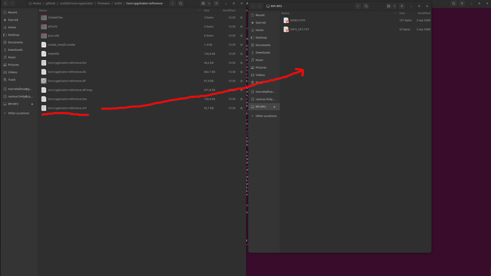

## Building for the Simulator
By default, running build.sh builds for the Pico hardware. Included in the workshop repo is a basic simulator that can be used for testing instead of flashing directly to the real hardware.
To enable building for the simulator, open CMakeLists.txt in the firmware folder. At the top, it has these include's.
```bash
include(${CMAKE_CURRENT_SOURCE_DIR}/pico_sdk_import.cmake)
include(${CMAKE_CURRENT_SOURCE_DIR}/FreeRTOS_Kernel_import.cmake)
#include(${CMAKE_CURRENT_SOURCE_DIR}/simulator.cmake)
```
If you replace the pico_sdk and FreeRTOS kernel import with simulator.cmake, the solution will be built for the simulator instead.

```bash
#include(${CMAKE_CURRENT_SOURCE_DIR}/pico_sdk_import.cmake)
#include(${CMAKE_CURRENT_SOURCE_DIR}/FreeRTOS_Kernel_import.cmake)
include(${CMAKE_CURRENT_SOURCE_DIR}/simulator.cmake)
```

Run build.sh, and you should see that your simulator files are built

**_NOTE:_** If you have built for Pico before this you need to clean the build folder
`rm -rf build/`
```
=== Simulator Output Files ===
./build/turn-cygnicator/turn-cygnicator
```

## Running the Simulator
The simulator uses the real FreeRTOS kernel so the scheduling works in the same way as on hardware. However, to support the compilation of the Pico SDK to run on your host device, we have mocked the functionality to provide basic write/read and interrupt handling. The implementation of the simulator is not 100% bulletproof, **if you have hardware available we suggest you use that**.

To run your solution in the simulator, run the program you built in the docker container. If standing in the firmware/ directory:

```bash
# By default this runs the reference implementation
./run-sim.sh


# ..you can try the simulator running blinky-demo
./run-sim.sh blinky-demo/blinky-demo
```


**_NOTE:_** You need to initialize the scheduler to be able to see the simulator view:


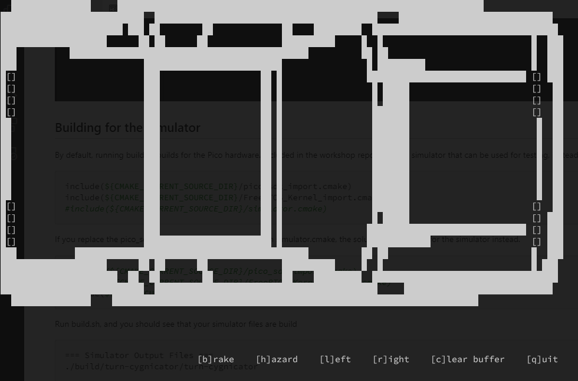

**_NOTE:_** Keep in mind that the Simulator is not fully implemented and will not work for all Pico SDK functions. If you would like to see what is included, please look under **simulator/hardware** and **simulator/pico**.

## Autocompletion in VS Code
Since we build everything in a Docker container, your IDE might not find the header files required for autocompletion. An easy way to get autocompletion to work for VSCode is to use the included [Devcontainer](https://code.visualstudio.com/docs/devcontainers/containers) configuration.
Open the cts2023-turn-cygnicator folder in VSCode and click the "Reopen in devcontainer" button popup (Or use the Command Palette to run Rebuild and Open In Devcontainer)

# Workshop starts here

Now the actual workshop starts.

Since the main focus of this workshop will be freeRTOS, we have provided an API for you to use to control the buzzer and LEDs, **inc/cygnicator_headlights.h**
This API includes TYPES and GPIO mappings to ease the process of turning on/off LEDs and use the buzzer.

We have gathered all API documentation needed for this workshop in [API Documentation](#api-documentation).
You don't need to read through all of the documentation before starting the workshop.

However, we recommend you read through one or more of the concepts introduced in each step to understand how the FreeRTOS concepts can be used to implement each feature for this workshop.


## Step 1: Handle button commands

Implement logic to handle the buttons TURN RIGHT, TURN LEFT, HAZARD and BRAKE

Concepts needed for this step:
- Use [Interrupt Handling](#interrupt-handling) or [Polling](#polling)
- Don't forget to read the Cygnicator API [Cygnicator API](#cygnicator-api)
- Optional in this step [FreeRTOS Task API](#freertos-task-api)


### Expected result

When a button is pressed you should see an output with correct gpio for the corresponding button: TURN RIGHT, TURN LEFT, HAZARD and BRAKE.

## Step 2: TURN LEFT and TURN RIGHT

Implement 2 tasks that can handle the interrupts from TURN RIGHT/LEFT button so that you can turn the LHS/RHS LEDs on and off.

Concepts needed for this step:
- Required in this step [FreeRTOS Task API](#freertos-task-api)
- Use one or more of the following concepts: [Inter-task communication](#inter-task-communication)

### Expected results:

* When TURN LEFT button is pressed the LHS LEDs should turn ON and RHS LEDs turn OFF. If the button is pressed again, the LHS LEDs should turn OFF
* When TURN RIGHT button is pressed the RHS LEDs should turn on and LHS LEDs turn OFF. If the button is pressed again, the RHS LEDs should turn OFF


## Step 3: Hazard

Implement logic so that the tasks can handle the HAZARD Button.

Concepts needed for this step:
-  Required: [Syncing tasks](#syncing-tasks)

### Expected results:

* When HAZARD button is pressed both LHS and RHS should turn ON at the same time. When button is pressed again, both sides should turn OFF at the same time.

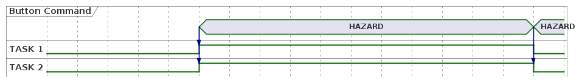

## Step 4: Buzzer (TICK/TOCK sound)

During a Turn indication there is a sound being played in the car to notify the driver. Some brands wants only a "Tick" when the LEDs goes from OFF -> ON and some wants both "Tick" and "Tock". Tick when LEDs goes from OFF -> ON and Tock when LED goes from ON -> OFF. Implement a new task that handles the sound functionality.

*Hint hint play_tone()*


### Expected results:

During HAZARD/TURN LEFT/TURN RIGHT commands there should be a sound being played when the corresponding LEDs are toggled. You can decide for yourself if you want only Tick or both Tick/Tock sounds.

## Step 5: Periodicity

Until this point, the LEDs can be turned ON/OFF with button commands. However, in the car, the turn indicators are periodically turning on/off during a right/left/hazard indication.

Introduce a periodicity so that when either HAZARD/LEFT/RIGHT Button is pressed, corresponding LEDs turn on/off periodically and tick/tock sound is heard. 

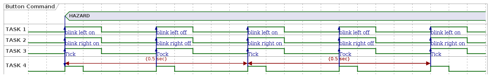


### Expected results:

When RIGHT/LEFT/HAZARD Button is pressed the corresponding LEDs should turn on/off with a frequency of 0.5 sec. First button press will start the indicaton, second button press will stop the indicaton, if it is the same button. If you switch from LEFT to RIGHT, then the lights should change from LHS to RHS and not turn of the indication completley.   


<figure class="video_container">
  <video controls="true" allowfullscreen="true">
    <source="img/periodicity.webm" type="video/webm">
  </video>
</figure>

## Step 6: Brake button
Brake indication is a very time-critical feature and it is very important that the REAR LEDs are switched on as soon as the brake button is pressed, else it could lead to a disaster in the traffic. Implement brake lights that are handled as the highest priority within the scheduler.


### Expected results:

When the brake button is pressed down, the REAR LED rows should turn on and the rest of the processes should be blocked. Once the brake is released the system should go back to the previous state.

<figure class="video_container">
  <video controls="true" allowfullscreen="true">
    <source="img/final.webm" type="video/webm">
  </video>
</figure>

## Step 7 (BONUS): One Task that controls each LED row
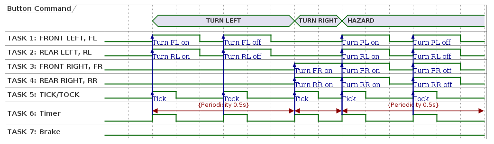

### Expected results:

Each LED row is controlled by its own task.

* T1 FRONT LEFT
* T2 REAR LEFT
* T3 FRONT RIGHT
* T4 REAR RIGHT
* T5 BUZZER


---


# API Documentation

We have gathered all API documentation needed for this lab in the subsections.

## Pico SDK API

### Interrupt Handling
With the pico SDK you can configure IRQ handling for GPIO. In the example below we have configured an IRQ for button TURN_LEFT which will print "Received an interrupt!" each time we click the button.

```C

void gpio_callback(uint gpio, uint32_t events) {
  printf("Received an interrupt on gpio %d with event %ld! \n", gpio, events);
}

int main() {
  gpio_set_irq_enabled_with_callback(
    gpio_buzzer_map[GPIO_BUTTON_TURN_LEFT], // gpio value
    GPIO_IRQ_EDGE_RISE,    // event mask
    true,                  // enabled
    &gpio_callback         // call back function
    );
}

```
**_NOTE:_** The example above is only for show. It is not a good practice to have printf in an ISR function. Since an interrupt handler needs to be very fast to not mess up the rest of the system.  

The callback function prototype is defined as:
```C
typedef void(* gpio_irq_callback_t) (uint gpio, uint32_t event_mask)
```
you can have 1 or more interrupt events configured for the same gpio
```C
// Event mask definition
enum gpio_irq_level {
  GPIO_IRQ_LEVEL_LOW = 0x1u, // Will trigger IRQ when gpio is low (0)
  GPIO_IRQ_LEVEL_HIGH = 0x2u, // Will trigger IRQ when gpio is high (1)
  GPIO_IRQ_EDGE_FALL = 0x4u, // Will trigger IRQ when gpio goes from 1 -> 0
  GPIO_IRQ_EDGE_RISE = 0x8u // Will trigger IRQ when gpio goes from 0 -> 1
};

//Eg:
gpio_set_irq_enabled_with_callback(
    gpio_buzzer_map[GPIO_BUTTON_TURN_LEFT], // gpio value
    GPIO_IRQ_EDGE_RISE | GPIO_IRQ_EDGE_FALL, // event mask
    true,                  // enabled
    &gpio_callback         // call back function
    );

```

see reference: [gpio_set_irq_enabled_with_callback](https://www.raspberrypi.com/documentation/pico-sdk/hardware.html#ga6165f07f4b619dd08ea6dc97d069e78a)

### Polling

If you don't want an interrupt based solution you could always use polling. Modern systems usually supports IRQ but sometimes you have no other option than to use polling.

The codeblock below is an example of a polling function that polls the gpio every 20 ms.

```C

void poll_gpio(uint gpio) {
  uint gpio_value = 0;
  while (1) {
    sleep_ms(20);
    gpio_value = gpio_get(gpio);
    printf("value: %d \n", gpio_value);
  }
}
```

## Cygnicator API

Here are some examples of how to use the API:

```C
// Turn on a LED row:
for (int i = 0; i < HEADLIGHT_SIZE_LIMIT; i++) {
  gpio_put(gpio_headlight_map[FRONT_LEFT][i], 1);
}

...

// Check the state of a button
if (1 == gpio_get(gpio_button_map[BUTTON_LEFT_INDICATOR])) {
  printf("BUTTON_LEFT_INDICATOR is pressed \n");
} else {
  printf("BUTTON_LEFT_INDICATOR is not pressed");
}

```
## FreeRTOS Task API

A real-time application that uses an RTOS can be structured as a set of independent tasks. Each task executes within its own context with no coincidental dependency on other tasks within the system or the RTOS scheduler itself. Only one task within the application can be executed at any point in time and the real-time RTOS scheduler is responsible for deciding which task this should be. The RTOS scheduler may therefore repeatedly start and stop each task (swap each task in and out) as the application executes. As a task has no knowledge of the RTOS scheduler activity, it is the responsibility of the real-time RTOS scheduler to ensure that the processor context (register values, stack contents, etc) when a task is swapped in is exactly that as when the same task was swapped out. To achieve this each task is provided with its own stack. When the task is swapped out the execution context is saved to the stack of that task so it can also be exactly restored when the same task is later swapped back in. 


This is a simplified task state diagram, containing only the states that we care about in this workshop:

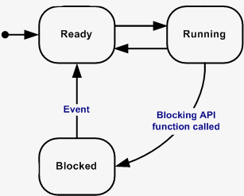

Tasks are automatically in ready state when created. The RTOS scheduler decides what task to run at a time. An example of a blocking API call is vTaskDelay.

Looking for more information? These are the sources we have used:
| Description                      | Link                                                               |
| -------------------------------- | ------------------------------------------------------------------ |
| FreeRTOS what is a task?         | [link](https://www.freertos.org/taskandcr.html)                    |
| FreeRTOS tasks states            | [link](https://www.freertos.org/RTOS-task-states.html)             |
| FreeRTOS Implementing tasks      | [link](https://www.freertos.org/implementing-a-FreeRTOS-task.html) |
| FreeRTOS xTaskCreate API         | [link](https://www.freertos.org/a00125.html)                       |
| FreeRTOS vTaskStartScheduler API | [link](https://www.freertos.org/a00132.html)                       |
| FreeRTOS vTaskDelay API          | [link](https://www.freertos.org/a00127.html)                       |


### xTaskCreate()

Create a new task and add it to the list of tasks that are ready to run.

### vTaskStartScheduler()

Starts the RTOS scheduler. After calling the RTOS kernel has control over which tasks are executed and when. Normally this function is called from within **main.c**.

Example usage:
```cpp

static void vTaskCode(void *parameters) {
  for(;;)
  {
    // Do something here
  }

  // Tasks normally never exits
}

 void main()
 {
     // Tasks can be created before or after starting the RTOS
     xTaskCreate( vTaskCode,
                  "NAME",
                  STACK_SIZE,
                  NULL,
                  tskIDLE_PRIORITY,
                  NULL );


     // Start the real time scheduler.
     vTaskStartScheduler();

     // Will not get here unless there is insufficient RAM.
 }
```

### vTaskDelay()

Delay a task for a given number of ticks. The actual time that the task remains blocked depends on the tick rate.

The function pdMS_TO_TICKS() can be used to calculate milliseconds to ticks using the tick rate with the resolution of one tick period.

Example:

```cpp
void vTaskFunction( void * pvParameters )
 {
    for( ;; )
    {
        /* Simply toggle the LED every 500ms, blocking between each toggle. */
        vToggleLED();

        // Block for 500ms
        vTaskDelay(pdMS_TO_TICKS(500));
    }
}
```
## Inter-task communication

There are multiple ways/concepts that can be used for inter-task communication such as Queues, Binary Semaphores, Mutexes, Direct Task notification and Stream/Message buffers. 

Queues are the primary form and they can be used to send messages between tasks, and between interrupts and tasks. In most cases they are used as thread safe FIFO (First In First Out) buffers with new data being sent to the back of the queue, although data can also be sent to the front of the queue.

### Queue example

```C
// Queue handler
static QueueHandle_t message_queue = NULL;

static void vTaskCode_rx(void *parameters) {
  int rx_value = 0;
  for(;;)
  {
    // block the rx task until a message is received on the queue with portMAX_DELAY
    xQueueReceive(
                    message_queue,
                    &rx_value,
                    portMAX_DELAY
                            );

    // if message received is equal to 1 then toggle the LEDs
    if (rx_value == 1)  {
      vToggleLED();
    }
  }

  // Tasks normally never exits
}
static void vTaskCode_tx(void *parameters) {
  int tx_value = 0;
  for(;;)
  {
    // Send a 1 to message_queue every 500 ms. 
    vTaskDelay(pdMS_TO_TICKS(500));

    tx_value = 1;

    xQueueSend(
      message_queue,
      tx_value,
      0
    );

  }

  // Tasks normally never exits
}

 void main()
 {
    // create a queue that can hold 3 integers
    message_queue = xQueueCreate(3, sizeof(int));

    // Tasks can be created before or after starting the RTOS

    // Create RX task
     xTaskCreate( vTaskCode_rx,
                  "vTaskCode_rx", 
                  STACK_SIZE,
                  NULL,
                  tskRECEIVE_PRIORITY,
                  NULL );
    // Create TX task
      xTaskCreate( vTaskCode_tx,
                  "vTaskCode_tx",
                  STACK_SIZE,
                  NULL,
                  tskSEND_PRIORITY,
                  NULL );


     // Start the real time scheduler.
      vTaskStartScheduler();

     // Will not get here unless there is insufficient RAM.
 }
```
### Binary Semaphores

Binary sempahores are used for both mutual exclusion and synchronisation purposes. You can think of binary semaphore as a queue with one item. There are also counting semaphores which works in a similar way but instead of having 1 item in the queue you can have multiple items.

```C
// Semaphore handler
SemaphoreHandle_t xSemaphore = NULL;

static void vTaskCode_a(void *parameters) {
  for(;;)
  {
    // Block task A until it can take the semaphore
    xSemaphoreTake( xSemaphore, portMAX_DELAY );
    // toggle the LEDs
    vToggleLED();
    
  }

  // Tasks normally never exits
}
static void vTaskCode_b(void *parameters) {
  for(;;)
  {

    // Unlock the semaphore every 500 ms. 
    vTaskDelay(pdMS_TO_TICKS(500));
    xSemaphoreGive(xSemaphore);
  }

  // Tasks normally never exits
}

 void main()
 {
    // Create the binary semaphore
    xSemaphore = xSemaphoreCreateBinary();

    // Tasks can be created before or after starting the RTOS

    // Create task A
     xTaskCreate( vTaskCode_a,
                  "vTaskCode_a", 
                  STACK_SIZE,
                  NULL,
                  tskIDLE_PRIORITY,
                  NULL );
    // Create task B
      xTaskCreate( vTaskCode_b,
                  "vTaskCode_b",
                  STACK_SIZE,
                  NULL,
                  tskIDLE_PRIORITY,
                  NULL );


     // Start the real time scheduler.
      vTaskStartScheduler();

     // Will not get here unless there is insufficient RAM.
 }
```
### Mutexes 

Mutexes are binary semaphores that include a priority inheritance mechanism. Whereas binary semaphores are the better choice for implementing synchronisation (between tasks or between tasks and an interrupt), mutexes are the better choice for implementing simple mutual exclusion (hence 'MUT'ual 'EX'clusion). 

```C
// Semaphore handler
SemaphoreHandle_t xSemaphore = NULL;

static void vTaskCode_a(void *parameters) {
  for(;;)
  {
    // Block task A until it can take the mutex
    xSemaphoreTake( xSemaphore, portMAX_DELAY );
    // toggle the LEDs
    vToggleLED();
    // give the mutex back
    xSemaphoreGive(xSemaphore);
  }

  // Tasks normally never exits
}
static void vTaskCode_b(void *parameters) {
  for(;;)
  {
    // Block task B until it can take the mutex
    xSemaphoreTake( xSemaphore, portMAX_DELAY );
    // Unlock the semaphore every 500 ms. 
    vTaskDelay(pdMS_TO_TICKS(500));
    // give the mutex back
    xSemaphoreGive(xSemaphore);
  }

  // Tasks normally never exits
}

 void main()
 {
    // Create the mutex
    xSemaphore = xSemaphoreCreateMutex();

    // Tasks can be created before or after starting the RTOS

    // Create task A
     xTaskCreate( vTaskCode_a,
                  "vTaskCode_a", 
                  STACK_SIZE,
                  NULL,
                  tskIDLE_PRIORITY,
                  NULL );
    // Create task B
      xTaskCreate( vTaskCode_b,
                  "vTaskCode_b",
                  STACK_SIZE,
                  NULL,
                  tskIDLE_PRIORITY,
                  NULL );


     // Start the real time scheduler.
      vTaskStartScheduler();

     // Will not get here unless there is insufficient RAM.
 }
```
### Direct Task notification 

A direct to task notification is an event sent directly to a task, rather than indirectly to a task via an intermediary object such as a queue, event group or semaphore. Sending a direct to task notification to a task sets the state of the target task notification to 'pending'. Just as a task can block on an intermediary object such as a semaphore to wait for that semaphore to be available, a task can block on a task notification to wait for that notification's state to become pending. 

You can use direct task notification as a lightweight:
* Binary Semaphore
* Counting Semaphore
* Event Group
* Mailbox

Basic example:
```C
/* Prototypes of the two tasks created by main(). */
static void prvTask1( void *pvParameters );
static void prvTask2( void *pvParameters );

/* Handles for the tasks create by main(). */
static TaskHandle_t xTask1 = NULL, xTask2 = NULL;

/* Create two tasks that send notifications back and forth to each other, 
then start the RTOS scheduler. */
void main( void )
{
    xTaskCreate( prvTask1, "Task1", 200, NULL, tskIDLE_PRIORITY, &xTask1 );
    xTaskCreate( prvTask2, "Task2", 200, NULL, tskIDLE_PRIORITY, &xTask2 );
    vTaskStartScheduler();
}
/*-----------------------------------------------------------*/

/* prvTask1() uses the 'indexed' version of the API. */
static void prvTask1( void *pvParameters )
{
    for( ;; )
    {
        /* Send notification to prvTask2(), bringing it out of the 
        Blocked state. */
        xTaskNotifyGiveIndexed( xTask2, 0 );

        /* Block to wait for prvTask2() to notify this task. */
        ulTaskNotifyTakeIndexed( 0, pdTRUE, portMAX_DELAY );
    }
}
/*-----------------------------------------------------------*/

/* prvTask2() uses the original version of the API (without the 
'Indexed'). */
static void prvTask2( void *pvParameters )
{
    for( ;; )
    {
        /* Block to wait for prvTask1() to notify this task. */
        ulTaskNotifyTake( pdTRUE, portMAX_DELAY );

        /* Send a notification to prvTask1(), bringing it out of the 
        Blocked state. */
        xTaskNotifyGive( xTask1 );
    }
}
```
### Stream/Message buffers

Stream buffers are an RTOS task to RTOS task, and interrupt to task communication primitives. Unlike most other FreeRTOS communications primitives, they are optimized for single reader single writer scenarios, such as passing data from an interrupt service routine to a task, or from one micro controller core to another on dual-core CPUs. Data is passed by copy - the data is copied into the buffer by the sender and out of the buffer by the read.

Stream buffers pass a continuous stream of bytes. Message buffers pass variable sized but discrete messages. Message buffers use stream buffers for data transfer. 

#### Stream buffers

Stream buffers can be created with callback send/receive functions which can be triggered on specific conditions, see example:
```C
void vSendCallbackFunction( StreamBufferHandle_t xStreamBuffer,
                            BaseType_t xIsInsideISR,
                            BaseType_t * const pxHigherPriorityTaskWoken )
{
    /* Insert code here which is invoked when a data write operation
     * to the stream buffer causes the number of bytes in the buffer
     * to be more then the trigger level.
     * This is useful when a stream buffer is used to pass data between
     * cores on a multicore processor. In that scenario, this callback
     * can be implemented to generate an interrupt in the other CPU core,
     * and the interrupt's service routine can then use the
     * xStreamBufferSendCompletedFromISR() API function to check, and if
     * necessary unblock, a task that was waiting for the data. */
}

void vReceiveCallbackFunction( StreamBufferHandle_t xStreamBuffer,
                               BaseType_t xIsInsideISR,
                               BaseType_t * const pxHigherPriorityTaskWoken )
{
    /* Insert code here which is invoked when data is read from a stream
     * buffer.
     * This is useful when a stream buffer is used to pass data between
     * cores on a multicore processor. In that scenario, this callback
     * can be implemented to generate an interrupt in the other CPU core,
     * and the interrupt's service routine can then use the
     * xStreamBufferReceiveCompletedFromISR() API function to check, and if
     * necessary unblock, a task that was waiting to send the data. */
}

void vAFunction( void )
{
  StreamBufferHandle_t xStreamBuffer, xStreamBufferWithCallback;
  const size_t xStreamBufferSizeBytes = 100, xTriggerLevel = 10;

    /* Create a stream buffer that can hold 100 bytes and uses the
     * functions defined using the sbSEND_COMPLETED() and
     * sbRECEIVE_COMPLETED() macros as send and receive completed
     * callback functions. The memory used to hold both the stream
     * buffer structure and the data in the stream buffer is
     * allocated dynamically. */
    xStreamBuffer = xStreamBufferCreate( xStreamBufferSizeBytes,
                                         xTriggerLevel );

    /* Create a stream buffer that can hold 100 bytes and uses the
     * functions vSendCallbackFunction and vReceiveCallbackFunction
     * as send and receive completed callback functions. The memory
     * used to hold both the stream buffer structure and the data
     * in the stream buffer is allocated dynamically. */
    xStreamBufferWithCallback = xStreamBufferCreateWithCallback( 
                                    xStreamBufferSizeBytes,
                                    xTriggerLevel,
                                    vSendCallbackFunction,
                                    vReceiveCallbackFunction );
}
```

#### Message buffers
Similarly to stream buffers, message buffers can also be created with a callback send/receive function. But there is no trigger value here which means that these functions will be triggered directly when something is inside the buffer.

``` C
void vSendCallbackFunction( MessageBufferHandle_t xMessageBuffer,
                            BaseType_t xIsInsideISR,
                            BaseType_t * const pxHigherPriorityTaskWoken )
{
    /* Insert code here which is invoked when a message is written to
     * the message buffer.
     * This is useful when a message buffer is used to pass messages between
     * cores on a multicore processor. In that scenario, this callback
     * can be implemented to generate an interrupt in the other CPU core,
     * and the interrupt's service routine can then use the
     * xMessageBufferSendCompletedFromISR() API function to check, and if
     * necessary unblock, a task that was waiting for message. */
}

void vReceiveCallbackFunction( MessageBufferHandle_t xMessageBuffer,
                               BaseType_t xIsInsideISR,
                               BaseType_t * const pxHigherPriorityTaskWoken )
{
    /* Insert code here which is invoked when a message is read from a message
     * buffer.
     * This is useful when a message buffer is used to pass messages between
     * cores on a multicore processor. In that scenario, this callback
     * can be implemented to generate an interrupt in the other CPU core,
     * and the interrupt's service routine can then use the
     * xMessageBufferReceiveCompletedFromISR() API function to check, and if
     * necessary unblock, a task that was waiting to send message. */
}

void vAFunction( void )
{
  MessageBufferHandle_t xMessageBuffer, xMessageBufferWithCallback;
  const size_t xMessageBufferSizeBytes = 100;

    /* Create a message buffer that can hold 100 bytes and uses the
     * functions defined using the sbSEND_COMPLETED() and
     * sbRECEIVE_COMPLETED() macros as send and receive completed
     * callback functions. The memory used to hold both the message
     * buffer structure and the data in the message buffer is
     * allocated dynamically. */
    xMessageBuffer = xMessageBufferCreate( xMessageBufferSizeBytes );

    /* Create a message buffer that can hold 100 bytes and uses the
     * functions vSendCallbackFunction and vReceiveCallbackFunction
     * as send and receive completed callback functions. The memory
     * used to hold both the message buffer structure and the data
     * in the message buffer is allocated dynamically. */
    xMessageBufferWithCallback = xMessageBufferCreateWithCallback( 
                                     xMessageBufferSizeBytes,
                                     vSendCallbackFunction,
                                     vReceiveCallbackFunction );
}
```

| Description                       | Link                                                                  |
| --------------------------------- | --------------------------------------------------------------------- |
| FreeRTOS Queues                   | [link](https://www.freertos.org/Embedded-RTOS-Queues.html)            |
| FreeRTOS Queue API                | [link](https://www.freertos.org/a00018.html)                          |
| FreeRTOS Binary Semaphores        | [link](https://www.freertos.org/Embedded-RTOS-Binary-Semaphores.html) |
| FreeRTOS Mutex                    | [link](https://www.freertos.org/Real-time-embedded-RTOS-mutexes.html) |
| FreeRTOS Semaphore/mutex API      | [link](https://www.freertos.org/a00113.html)                          |
| FreeRTOS Task Notifications       | [link](https://www.freertos.org/RTOS-task-notifications.html)         |
| FreeRTOS Task Notifications API   | [link](https://www.freertos.org/RTOS-task-notification-API.html)      |
| FreeRTOS Stream & Message Buffers | [link](https://www.freertos.org/RTOS-stream-message-buffers.html)     |
| FreeRTOS Stream buffers API       | [link](https://www.freertos.org/RTOS-stream-buffer-API.html)          |
| FreeRTOS Message buffers API      | [link](https://www.freertos.org/RTOS-message-buffer-API.html)         |


## Syncing tasks

There are multiple ways of syncing between tasks but the fundamental part is the concept of periodic interrupts which FreeRTOS calls **tick interrupts**.
Each **tick interrupt** the scheduler will 
 **tick period** and **tick count**. **Tick count** is the number of **tick interrupts** that have occurred since the FreeRTOS application started. This is used as a measure of time. **tick period** is the time between two **tick interrupts**. This period can be configured in the FreeRTOSConfig.h file by changing **configTICK_RATE_HZ**.

As we explained in the presentation the tick interrupt can be modified in the **FreeRTOSConfig.h**. 
```C
// FreeRTOSConfig.h

// This will give a tick period of 10 ms. 1/100 = 0,01 from f = 1/T
#define configTICK_RATE_HZ 100
```

**_NOTE:_** You don't need to change `configTICK_RATE_HZ` to complete this task. This text is only for explaining what a tick is in FreeRTOS and how we specify this in time.

FreeRTOS stores the tick count in a data type called **TickType_t**.

FreeRTOS recommends that the developers use **pdMS_TO_TICKS();** when specifying a time, since this macro is based on **configTICK_RATE_HZ**.

Inter-task communication is not only used to communicate between tasks but also to sync between tasks. Either TX or RX functions have a **TickType_t xTicksToWait** parameter or both. 

Some examples from FreeRTOS API
```C
// Queue send function prototype
 BaseType_t xQueueSend(
                            QueueHandle_t xQueue,
                            const void * pvItemToQueue,
                            TickType_t xTicksToWait
                         );
// Queue receive function prototype
 BaseType_t xQueueReceive(
                              QueueHandle_t xQueue,
                              void *pvBuffer,
                              TickType_t xTicksToWait
                            );

// Semaphore take function prototype
xSemaphoreTake( SemaphoreHandle_t xSemaphore,
                 TickType_t xTicksToWait );

// Semaphore give function prototype
xSemaphoreGive( SemaphoreHandle_t xSemaphore );

// Direct to task notification take function prototype
uint32_t ulTaskNotifyTake( BaseType_t xClearCountOnExit,
                            TickType_t xTicksToWait );

// Direct to task notification give function prototype
BaseType_t xTaskNotifyGive( TaskHandle_t xTaskToNotify );

```
If we look at the code example for [Queue example](#queue-example) we can see that **vTaskCode_tx** uses a vTaskDelav(); Which will make the scheduler to suspend the tx task for 500 ms and then wake it up to send a message to **vTaskCode_rx**. **vTaskCode_tx** can therefore be seen as a periodic task that drives the timing of when the event should occur.

Tasks can be synchronized by either using relative time or absolute time.
```C
/*
vTaskDelay() specifies a wake time relative to the time at which the function
is called, vTaskDelayUntil() specifies the absolute (exact) time at which it wishes to
unblock.

if you want to have a fixed frequency, this can be hard to achieve with vTaskDelay since the task may take a different path through the
code between calls, or may get interrupted or preempted a different number of times each time it executes.
*/

// relative time delay
void vTaskFunction( void * pvParameters )
{
 /* Block for 500ms. */
  const TickType_t xDelay = 500 / portTICK_PERIOD_MS;

     for( ;; )
     {
         /* Simply toggle the LED every 500ms from when vTaskDelay was called, suspending the task between each toggle. */
         vToggleLED();
         vTaskDelay( xDelay );
     }
}

// Absolute time delay
void vTaskFunction( void * pvParameters )
{
  TickType_t xLastWakeTime;
  const TickType_t xFrequency = 10;

     /*
      xTaskGetTickCount(); will return the count of ticks since vTaskStartScheduler was called.
     */

     // Initialize the xLastWakeTime variable with the current time.
     xLastWakeTime = xTaskGetTickCount();

     for( ;; )
     {
         // Wait for the next cycle which is 10 ticks.
         vToggleLED();
         vTaskDelayUntil( &xLastWakeTime, xFrequency );
     }
}
```

### Event Groups
A recommended way from FreeRTOS is to use Event groups when the application require 2 or more tasks to synchronize. Imagine a **Task A** who has received an event and will delegate some work to **Task B** and **Task C**. If **Task A** can't receive a new event until the other tasks are done, then they need to synchronize with each other. An event group can be used to create a synchronization point. To achieve this, each task are assigned an unique event bit within the event group. Each task sets its own unique bit and then wait for all the other bits to be set.

example from FreeRTOS:

```C

static void vSyncingTask( void *pvParameters )
{
  const TickType_t xMaxDelay = pdMS_TO_TICKS( 4000UL );
  const TickType_t xMinDelay = pdMS_TO_TICKS( 200UL );
  TickType_t xDelayTime;
  EventBits_t uxThisTasksSyncBit;
  const EventBits_t uxAllSyncBits = ( mainFIRST_TASK_BIT |
                                    mainSECOND_TASK_BIT |
                                    mainTHIRD_TASK_BIT );
  /* Three instances of this task are created - each task uses a different event
  bit in the synchronization. The event bit to use is passed into each task
  instance using the task parameter. Store it in the uxThisTasksSyncBit
  variable. */
  uxThisTasksSyncBit = ( EventBits_t ) pvParameters;
  for( ;; )
  {
    /* Simulate this task taking some time to perform an action by delaying for a
    pseudo random time. This prevents all three instances of this task reaching
    the synchronization point at the same time, and so allows the example’s
    behavior to be observed more easily. */
    xDelayTime = ( rand() % xMaxDelay ) + xMinDelay;
    vTaskDelay( xDelayTime );
    /* Print out a message to show this task has reached its synchronization
    point. pcTaskGetTaskName() is an API function that returns the name assigned
    to the task when the task was created. */
    vPrintTwoStrings( pcTaskGetTaskName( NULL ), "reached sync point" );
    /* Wait for all the tasks to have reached their respective synchronization
    points. */
    xEventGroupSync( /* The event group used to synchronize. */
    xEventGroup,
    /* The bit set by this task to indicate it has reached the
    synchronization point. */
    uxThisTasksSyncBit,
    /* The bits to wait for, one bit for each task taking part
    in the synchronization. */
    uxAllSyncBits,
    /* Wait indefinitely for all three tasks to reach the
    synchronization point. */
    portMAX_DELAY );
    /* Print out a message to show this task has passed its synchronization
    point. As an indefinite delay was used the following line will only be
    executed after all the tasks reached their respective synchronization
    points. */
    vPrintTwoStrings( pcTaskGetTaskName( NULL ), "exited sync point" );
  }
}

/* Definitions for the event bits in the event group. */
#define mainFIRST_TASK_BIT ( 1UL << 0UL ) /* Event bit 0, set by the first task. */
#define mainSECOND_TASK_BIT( 1UL << 1UL ) /* Event bit 1, set by the second task. */
#define mainTHIRD_TASK_BIT ( 1UL << 2UL ) /* Event bit 2, set by the third task. */

/* Declare the event group used to synchronize the three tasks. */
EventGroupHandle_t xEventGroup;
int main( void )
{
  /* Before an event group can be used it must first be created. */
  xEventGroup = xEventGroupCreate();
  /* Create three instances of the task. Each task is given a different name,
  which is later printed out to give a visual indication of which task is
  executing. The event bit to use when the task reaches its synchronization point
  is passed into the task using the task parameter. */
  xTaskCreate( vSyncingTask, "Task 1", 1000, mainFIRST_TASK_BIT, 1, NULL );
  xTaskCreate( vSyncingTask, "Task 2", 1000, mainSECOND_TASK_BIT, 1, NULL );
  xTaskCreate( vSyncingTask, "Task 3", 1000, mainTHIRD_TASK_BIT, 1, NULL );
  /* Start the scheduler so the created tasks start executing. */
  vTaskStartScheduler();
  /* As always, the following line should never be reached. */
  for( ;; );
    return 0;
  }
```
**Output from example above:**

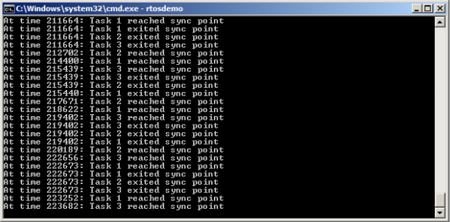

In the image you can see that the time when the tasks reaches the sync point varies a lot, but are very synchronized when exiting the sync point.
